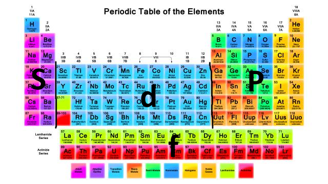

[Wstecz](../chemia.md)

# Konfiguracje elektronowe

2n^2

n - numer powłok

K - 2

L - 8

M - 18

N - 32

O - 50

P - 72
Q - 98

SUMA = 280

           +3      2         1

powłoka           K^2     L^1

podpowłoka    1s^2   2s^1

1s^2 2s^2 2p^6 3s^2 3p^6 4s^2 3d^6

K^2L^6M^14N^2

Fe [Ar] 4s^2 3d^6