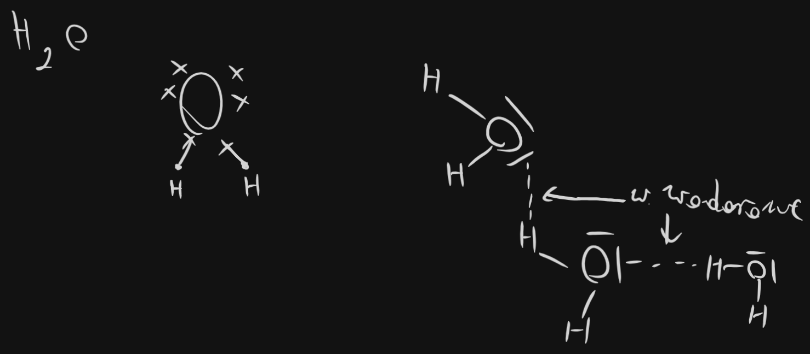
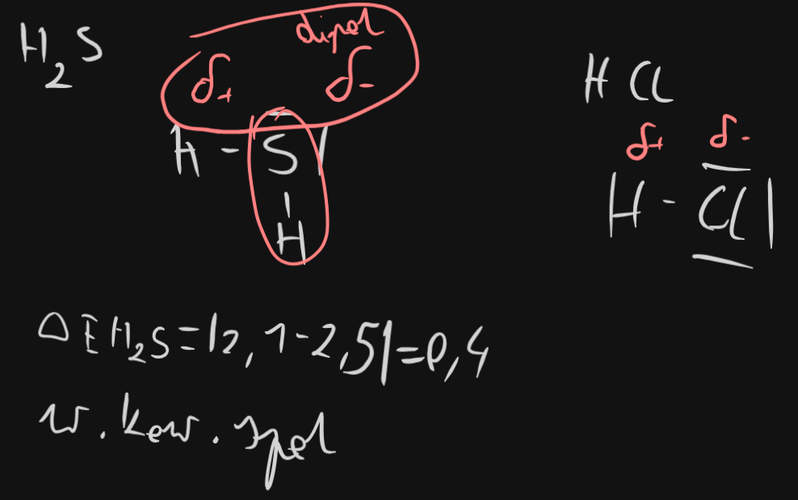

[Wstecz](../chemia.md)

# Oddziaływania międzycząsteczkowe

1.  Wiązanie (oddziaływanie) wodorowe

    -   oddziaływanie między atomem H jednej cząsteczki a atomem F/O/N drugiej cząsteczki

    

    

2.  dipol-dipol

    -   oddziaływanie między wolną parą elektronową jednego atomu a drugim atomem (o niższej elektroujemności)

    
