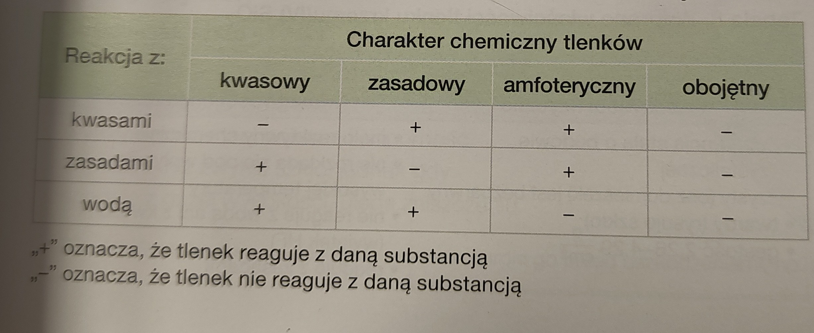

[Wstecz](../chemia.md)

# Tlenki

E2On - wzór ogólny

E - pierwiastek

n - wartościowość

tlenek siarki (Ui)

x+2\*3=0

x=|6|

CO2+H2SO4→x(reakcja nie zachodzi)

2CO2+2KOH→K2CO3→K2CO3+H2O

CO2+H2O→H2CO3

Na2O+H2SO2→Na2SO2+H2O

ZnO+H2SO4→ZnSO4+H2O

ZnO+2KOH+H2O→K2[Zn(OH)4] ←— związek kompleksowy

ZnO+H2O→x

NO+H2SO4→x

NO+H2O→x

12/78

-   Li(I)2O(II)
-   Cl(VII)2O(II)7
-   P(III)4O(II)6
-   Mg(II)O(II)
-   N(V)2O(II)5
-   N(II)O(II)

2/78

-   tlenek potasu
-   tlenek boru
-   tlenek chloru (IV)
-   tlenek żelaza (III)

Otrzymywanie tlenków

1. bezpośrednia synteza
    1. C+O2→CO2
    2. 4P+3O2→P4O6
2. utlenianie tlenków o niższej wartościowości
    1. 4FeO+O2→2Fe2O3
    2. N2O3+O2→N2O5
3. rozkład soli lub wodorotlenków
    1. CaCO3→CaO+CO2
    2. Cu(OH)2→CuO+H2O
    3. Fe(OH)3→Fe2O3+H2O

30/287

-   tlenek azotu(IV)
-   tlenek azotu(III)
-   tlenek chloru(VII)
-   tlenek chloru(V)
-   tlenek potasu
-   tlenek siarki(IV)
-   tlenek krzemu(IV)
-   tlenek miedzi(II)
