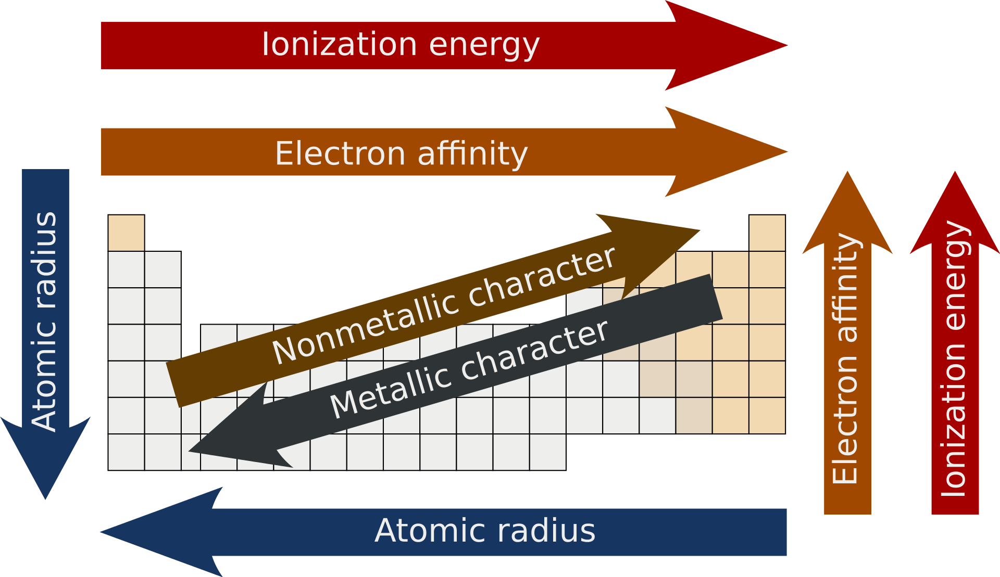

[Wstecz](../chemia.md)

# Właściwości układu okresowego

promień atomu - odległość od jądra atomowego do najdalszej powłoki

rośnie w dół → rośnie liczba powłok (nr okresu)

rośnie od prawej do lewej → zmniejsza sie l. protonów w jądrze

(maleje od lewej do prawej)

energia jonizacji - energia potrzebna do wybicia elektronu]

od lewej do prawej rośnie — zwiększa się l. protonów (zmniejsza sie promień)

→ rośnie od dołu do góry → zmniejsza się atom (zwiększa l. protonów)

powinoowarstwo elektronowe - energia potrwa do przyłączenia eoektronu

egzotermiczna

elektroujemność - zdolność od przyjmowania eektronów w wiązaniach

3/41

Symbole bloku:

-   potas - blok S
-   magnez - blok S
-   azot - blok P
-   fosfor - blok P
-   siarka - blok p

a) K>Mg>P>N>S

b) K<Mg<P<N<S

c) N<Mg<P<S<K
