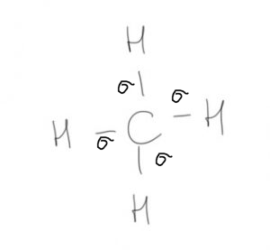
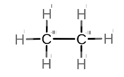
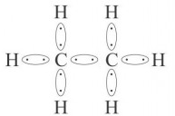

[Wstecz](../chemia.md)

# Metan - budowa cząsteczki, otrzymywanie i właściwości

### $`CH_4`$

!

$`\sigma`$ - mocne

$`C_2H_6\space\space`$ $`\space\space CH_3-CH_3`$

 

### 1) całkowite

$`CH_4 + 2O_2 \rightarrow CO_2 + 2H_2O`$

### 2) półspalanie

$`2CH_4 + 3O_2 \rightarrow 2CO + 4H_2O`$

### 3) częściowe do sadzy

$`CH_4 + O_2 \rightarrow C + 2H_2O`$

### 4) reakcja substytucji

$`CH_4 + Cl_2 \xrightarrow{św} CH_3Cl + HCl`$ -> chlorometan

$`CH_3Cl + Cl_2 \xrightarrow{św} CH_2Cl_2 + HCl`$ -> dichlorometan

$`CH2_Cl_2 + Cl_2 \xrightarrow{Św} CHCl_3 + HCl`$ -> trichlorometan

$`CHCl_3 + Cl_2 \xrightarrow{Św} CH_2Cl_3 + HCl`$ -> tetrachlorometan

2 -> di-

3 -> tri-

4 -> tetra-

5 -> penta-

6 -> hexa-

7 -> hepta-

8 -> octa-

9 -> nona-

### spalanie metanu w odpowiednich warunkach

$`2CH_4 + O_2 \xrightarrow{kat} CO + 4H_2`$`$ -> gaz syntezowy
