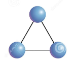
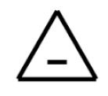

[Wstecz](../chemia.md)

# Węglowodory

Węglowodory:

-   łańcuchowe
    -   nasycone
        -   alkany
            -   $`C_nH_{2n+2}`$
            -   -an
            -   $`CH_4`$ met<u>an</u>
            -   substytycja -> $`CH_4+Cl_2 \xrightarrow{hv} CH_3Cl+HCl`$
    -   nienasycone
        -   alkeny
            -   $`C_nH_{2n}`$
            -   -en
            -   $`C_2H_4`$ et<u>en</u>
        -   alkiny
            -   $`C_nH_{2n-2}`$
            -   -yn
            -   $`C_2H_2`$ et<u>yn</u>
-   pierścienieniowe

    -   nasycone

        -   cykloalkany

            -   cyklopropan

            

    -   nienasycone

        -   cykloaleny

            -   cyklopropen

            

    -   aromatyczne

        -   benzen

        
