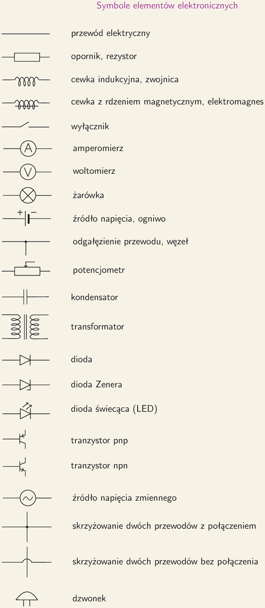
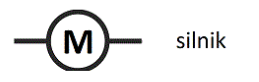
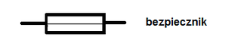
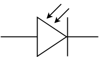

[Wstecz](../fizyka.md)

# Obwody elektryczne

 fotodioda

Wymogi: przewód, węzeł, źródło energii, włącznik/wyłącznik, żarówka, woltomierz, amperomierz, opornik, opornik suwakowy, bezpiecznik, silnik, źródło energii elektrycznej prądu przemiennego, fotodioda, dioda led, dioda prostownicza (po prostu dioda na schemacie), dioda Zenera, tranzystor
