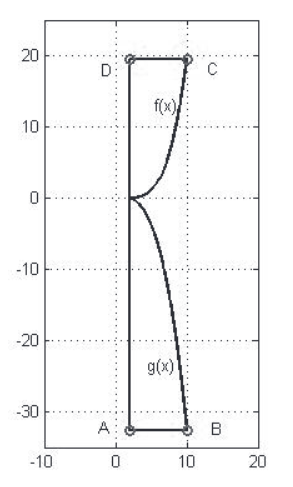
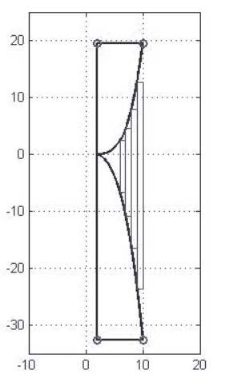

[Wstecz](../informatyka.md)

# Wiązka zadań Zasłona

Pani Binarna dostała zlecenie na uszycie zasłony. Na rysunku poniżej przedstawiono zasłonę, która jest ograniczona:

-   od góry prostą $`y=19\frac{61}{125}`$,
-   od dołu prostą $`y=-32\frac{2}{3}`$,
-   z lewej strony prostą $`x=2`$
-   z prawej strony dwoma krzywymi: $`f(x)=\frac{x^4}{500}-\frac{x^2}{200}-\frac{3}{250}`$ oraz $`g(x)=-\frac{x^3}{30}+\frac{x}{20}+\frac{1}{6}`$

**Uwaga:** Zauważ, że $`f(10)=19\frac{61}{125}`$, zaś $`g(10)=-32\frac{2}{3}`$



Korzystając z dostępnych narzędzi informatycznych, wykonaj poniższe zadania. Odpowiedzi do nich umieść w pliku `zadanie_zaslona.txt`. Każda odpowiedź powinna być poprzedzona numerem je oznaczającym.

### 70.1

Pani Binarna zakupiła tyle materiału, ile wynosi pole prostokąta ABCD, w którym mieści się zasłona. Oblicz, jaka będzie powierzchnia materiału pozostałego po wykrojeniu zasłony. Wynik podaj z dokładnością do 1/1000.

### 70.2

Pani Binarna zamierza obszyć taśmą zasłonę ze wszystkich czterech stron, w tym celu chce wyznaczyć obwód zasłony. Część obwodu ograniczoną wykresem funkcji f(x) szacujemy w następujący sposób: Odcinek $`[2,10]`$ dzielimy na 1000 równych części, których prawe końce oznaczamy przez $`x_1,...,x_{1000}`$. Długość krzywej odpowiadającej wykresowi $`f(x)`$ na przedziale $`[2,10]`$ przybliżamy długością łamanej łączącej punkty $`(2, f(2)), (x1, f(x1)), (x2, f(x2))`$ itd. aż do $`(x_{1000}, f(x_{1000}))`$. Analogicznie wyznaczamy część obwodu ograniczoną przez $`g(x)`$.

Stosując powyższą metodę wyznaczania obwodu, oblicz długość taśmy, jaką musi zakupić pani Binarna, zakładając, że w sprzedaży jest tylko taśma o długościach będących wielokrotnością jednego metra.

### 70.3

Pani Binarna postanowiła wykorzystać pozostały fragment materiału i wyciąć z niego pasy o szerokości 0,25 m i o bokach równoległych do osi układu współrzędnych. Podaj sumę długości pasów, które można wyciąć z pozostałego fragmentu materiału. Załóż, że długość każdego wyciętego pasa jest liczbą całkowitą oraz że pani Binarna zaczyna wycinać pasy od prawej strony materiału



### Pomoce

**CAŁKA**

```py
def f(x):
    return x*x+1

def calka(a, b, epsilon):
    x = (b-a)/epsilon
    pole = 0
    for i in range(epsilon):
        y = f(a+i*x)
        pole += y*x
    return pole

print(calka(0, 4, 1000))
```

### Metoda

**7.1**

1.

**7.2**

1.

**7.3**

1.

### [Kod](wiazka-zadan-zaslona.py)

```python

```
