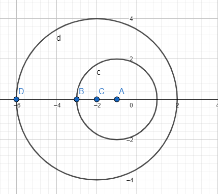

[Wstecz](../matematyka.md)

# Okręgi i koła

## Wzory

### Obwód

#### Okrąg

$`l = 2 \pi r`$

#### Koło

$`l = \pi d`$

### Pole

#### Okrąg

$`P = \pi r^2`$

#### Koło

$`P = \frac{1}{4} \pi d^2`$

### Kąt środkowy

$`L = \frac{\alpha}{360} \cdot 2 \pi r`$

### Stykające się okręgi

#### Zewnętrzne

$`|O_1O_2| = r_1 + r_2`$

#### Wewnętrzne

$`|O_1O_2| = |r_1 - r_2|`$

### Przecinające się okręgi

$`|r_1-r_2| < |O_1O_2| < r_1 + r_2`$

### Rozłączne okręgi

#### Wewnętrzne

$`|O_1O_2| > r_1 + r_2`$

#### Zewnętrzne

$`|O_1O_2| < |r_1 - r_2|`$

#### Zad 1

$`r = 3`$

$`l = 2 \pi r = 2 \pi 3 = 6 \pi`$

#### Zad 2

$`L = \frac{75}{360} \cdot 2 \pi 6 = \frac{5}{2}\pi`$

#### Zad 3

$`L = 2\pi`$

$` \alpha = 20\degree`$

$`1 = \frac{1}{18} r`$

$`r = 18`$

$`d = 36`$

#### Ćwiczenie 3

$`|O_1O_4| = 48`$

$`r = \frac{48}{6} = 8`$

$`d = 16`$`

### PRACA DOMOWA

6ad/226

0 Pukntów wspólnych

$`|O_1O_2| = 1`$

0 Punktów wspólnych

$`|O_1O_2| = 5`$

7/226

$`|O_1O_3| = 18`$

$`|O_2O_3| = 12`$

$`r_{O_1 \space \vee \space O_2} = 6`$

$`d_{O_1 \space \vee \space O_2} = 12`$

$`d_{O_3} = 24`$