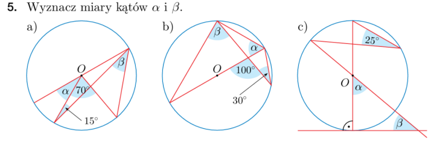
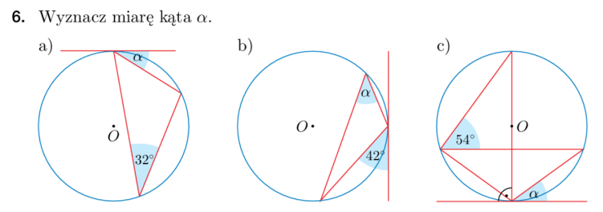
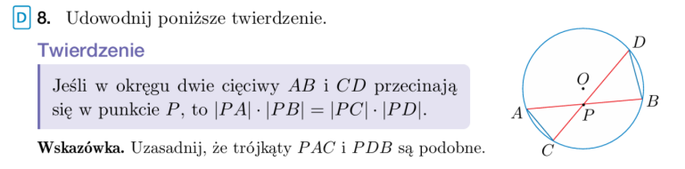
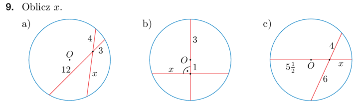
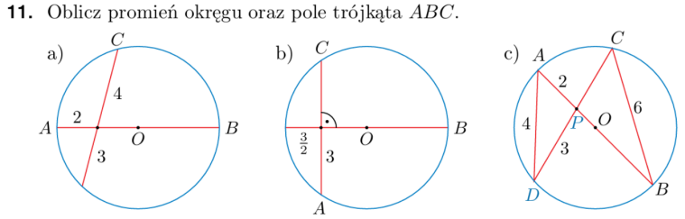

[Wstecz](../matematyka.md)

# Praca na lekcji - miary kątów

#### a)

$`\beta = 35 \degree, \space \alpha = 30 \degree `$

#### b)

$`\beta = 70\degree, \space \alpha = 60\degree`$

#### c)

$`\beta = 40\degree, \space \alpha = 50\degree`$

#### a)

$`\alpha = 32\degree`$

#### b)

$`\alpha = 42\degree`$

#### c)

$`\alpha = 36\degree`$

$`|\angle{APC}| = |\angle{DPB}|`$

$`|\angle{PAC}| = |\angle{CDP}|`$

$`|\angle{PCA}| = |\angle{PBD}|`$

$`\frac{|AP|}{|PD|} = \frac{CP}{PB}`$

$`|AP| \cdot |PB| = |CP| \cdot |PD|`$

#### a)

$`12 \cdot 3 = 4 \cdot x`$

$`\frac{12 \cdot 3}{4} = x`$

$`x = 9`$

#### b)

$`x^2 + 1^2 = 3^2`$

$`x^2 + 1 = 9`$

$`x^2 = 8`$

$`x = \sqrt{8} = 2\sqrt{2}`$

#### c)

$`x + y = 5\frac{1}{2}`$

$`y = 5\frac{1}{2} - x`$

$`(5\frac{1}{2} + y) \cdot x = 4 \cdot 6`$

$`(5\frac{1}{2} + 5\frac{1}{2} - x) \cdot x = 24`$

$`(11 - x) \cdot x = 24`$

$`11x - x^2 = 24`$

$`x^2 - 11x + 24 = 0`$

$`\triangle = 121 - 96 = 25`$

$`x_1 = \frac{-11 - 5}{-2} = 8 \space sprzeczność, \space bo \space x \in (0,5\frac{1}{2})`$

$`x_2 = \frac{-11 + 5}{-2} = 3`$

#### a)

$`|AO| = |OB| = 2 + x`$

$`2 \cdot (x + 2 + x) = 4 \cdot 3`$

$`2 \cdot (2 + 2x) = 12`$

$`4 + 4x = 12`$

$`4x = 8`$

$`x = 2`$

$`R = 2 + 2 = 4`$

$`|PC| = 4, \space |PO| = x = 2, \space |OC| = R = 4`$

$`1^2 + h^2 = 4^2`$

$`1 + h^2 = 16`$

$`h^2 = 15`$

$`h = \sqrt{15}`$

$`P_{ABC} = \frac{1}{2} \cdot |AB| \cdot h = \frac{1}{2} \cdot 8 \cdot \sqrt{15} = 4\sqrt{15}`$

#### b)

$`x^2 + 3^2 = (\frac{3}{2} + x)^2`$

$`x^2 + 9 = \frac{9}{4} + 2 \cdot \frac{3}{2} \cdot x + x^2`$

$`9 = \frac{9}{4} + 3x`$

$`\frac{36}{4} = \frac{9}{4} + 3x`$

$`\frac{27}{4} = 3x`$

$`x = \frac{27}{12} = \frac{9}{4}`$

$`r = \frac{3}{2} + \frac{9}{4} = \frac{6}{4} + \frac{9}{4} = \frac{15}{4} = 3\frac{3}{4}`$

$`P_{ABC} = \frac{1}{2} \cdot a \cdot h = \frac{1}{2} \cdot 6 \cdot (x + \frac{3}{2} + x) = 3 \cdot (2x + \frac{3}{2}) = 3 \cdot (2 \cdot \frac{9}{4} + \frac{3}{2}) = 3 \cdot (\frac{9}{2} + \frac{3}{2}) = 3 \cdot 6 = 18`$

#### c)

$`|\angle{DPA}| = |\angle{BPC}|`$

$`|\angle{DAB}| = |\angle{DCB}|`$

$`|\angle{ADC}| = |\angle{ABC}|`$

$`\frac{|AD|}{|AP|} = \frac{BC}{CP}`$

$`\frac{4}{2} = \frac{6}{|CP|}`$

$`2 \cdot |CP| = 6`$

$`|CP| = 3`$

$`\frac{|AD|}{|DP|} = \frac{BC}{BP}`$

$`\frac{4}{3} = \frac{6}{|BP|}`$

$`\frac{3 \cdot 6}{4} = |BP|`$

$`|BP| = \frac{18}{4} = 4\frac{1}{2}`$

$`R = \frac{1}{2} \cdot |AB| = \frac{1}{2} \cdot (|AP| + |PB|) = \frac{1}{2} \cdot (2 + 4,5) = \frac{1}{2} \cdot 6,5 = 3,25`$

$`|AC|^2 + 6^2 = 6,5^2`$

$`|AC|^2 + 36 = 42,25`$

$`|AC|^2 = 42,25 - 36 = 6,25`$

$`|AC| = \sqrt{6,25} = 2,5`$

$`P_{ABC} = \frac{1}{2} \cdot |AC| \cdot |CB| = \frac{1}{2} \cdot 2,5 \cdot 6 = 7,5`$