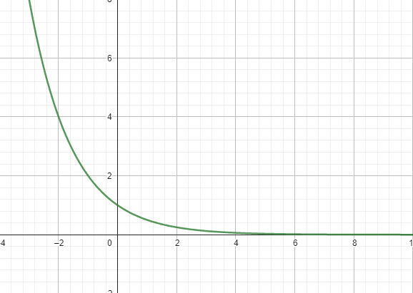
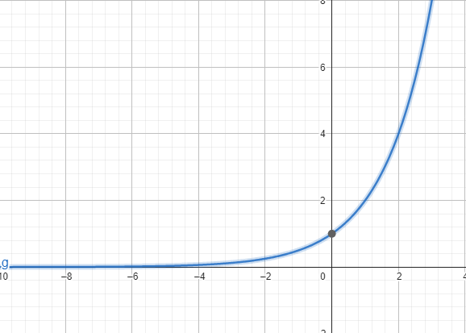

[Wstecz](../matematyka.md)

# Funkcja wykładnicza

$`f(x)=a^x`$ dla $`x \in \mathbb{R}`$

dla $`0<a<1 \space f(x)\downarrow`$, a dla $`a>1 \space f(x)\uparrow`$

 

### Ćwiczenie 2/288

$`f(x)=2^x, g(x)=(\frac{3}{2})^x, h(x)=(\frac{4}{3})^x`$

#### b)

$`P=(4,a)`$

$`y=(\frac{3}{2})^x`$

$`a=(\frac{3}{2})^4`$

$`a=\frac{81}{16}`$

$`Q=(-2,b)`$

$`b=(\frac{3}{2})^{-2}`$

$`b=(\frac{2}{3})^2`$

$`b=\frac{4}{9}`$

$`R=(c,3\frac{3}{8})`$

$`3\frac{3}{8}=(\frac{3}{2})^c`$

$`\frac{27}{8}=\frac{3}{2}^3`$

$`c=3`$

#### c)

$`(\frac{4}{3}^{-\frac{1}{2}})= \frac{\sqrt3}{2}`$

$`\sqrt{\frac{3}{4}}=\frac{\sqrt3}{2}`$

$`\sqrt{\frac{3}{4}}=\frac{\sqrt3}{\sqrt4}=\frac{\sqrt3}{2}`$

$`c \in h(x)`$

### Zadanie 2/290

$`f(x)=a^x`$

$`P=(2,16)`$

$`16=x^2`$

$`a=4`$

#### d)

$`Q=(-\frac{1}{4},\frac{\sqrt2}{2})`$

$`\frac{\sqrt2}{2}=4^{-\frac{1}{4}}`$

$`4^{-\frac{1}{4}}=(\frac{1}{4})^{\frac{1}{4}}=(\frac{1}{4})^{\frac{1}{2} \cdot \frac{1}{2}}=(\frac{1}{2})^{\frac{1}{2}}=\sqrt{\frac{1}{2}}=\frac{\sqrt1}{\sqrt2}=\frac{1}{\sqrt2}=\frac{\sqrt2}{\sqrt2 \cdot \sqrt2}=\frac{\sqrt2}{2}`$

### Zadanie 5/290

a) $`f(x)=(\frac{\sqrt2}{2})^x`$ funkcja malejąca

b) $`f(x)=(\sqrt3-1)^x`$ funkcja malejąca

c) $`f(x)=(\sqrt5-1)^x`$ funkcja rosnąca

### Zadanie 6/290

a) $`2^{\frac{7}{5}}<2^{\sqrt2}<2^{\frac{3}{2}}<2^{\sqrt3}`$

b) $`(\frac{3}{4})^6<(\frac{3}{4})^{\sqrt{26}}<(\frac{3}{4})^5<(\frac{3}{4})^{2\sqrt6}`$

c) $`\pi^{\frac{1}{\pi}}<\sqrt[3]\pi<\pi^{\frac{3}{7}}<\pi^{\frac{1}{2}}`$

d) $`9^{-2}<9^{-\sqrt\pi}<9^{\sqrt3}<9^0`$

### Zadanie 7/291

#### b)

$`f(x)=(\frac{1}{3})^x`$ funkcja malejąca

$`(\frac{1}{3})^{3 \sqrt{2}}`$

$`(\frac{1}{9})^{2,6}=((\frac{1}{3})^2)^{2,6}=(\frac{1}{3})^{5,2}`$

$`(\frac{1}{27})^{\frac{3}{2}}=((\frac{1}{3})^3)^{\frac{3}{2}}=(\frac{1}{3})^{\frac{9}{2}}`$

$`(\frac{1}{81})^{\frac{3}{2}}=((\frac{1}{3})^4)^{\frac{3}{2}}=(\frac{1}{3})^6`$

$`\frac{1}{243}=(\frac{1}{3})^5`$

$`(\frac{1}{3})^{3 \sqrt{2}}>(\frac{1}{3})^{\frac{9}{2}}>(\frac{1}{3})^5>(\frac{1}{3})^{5,2}>(\frac{1}{3})^6`$

$`(\frac{1}{3})^{3 \sqrt{2}}>(\frac{1}{27})^{\frac{3}{2}}>\frac{1}{243}>(\frac{1}{9})^{2,6}>(\frac{1}{81})^{\frac{3}{2}}`$

### Zadanie 9/291

a) $`f(x) \geq g(x)`$ dla $`x \in (-\infty, 0\rangle \cup \langle 2,+\infty)`$

b) $`f(x) \geq g(x)`$ dla $`x \in (-\infty, 0\rangle \cup \langle 2,+\infty)`$

### Zadanie 10/291

a) $`2^x>3^x`$ dla $`x \in (-\infty,9)`$

b) $`3^x \leq 4^x`$ dla $`x \in \langle 0, +\infty)`$
