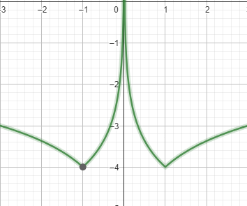

[Wstecz](../matematyka.md)

# Przekształcanie wykresów funkcji logarytmicznej

Odczytaj z wykresów liczbę rozwiązań równania z parametrem.

$`f(x)=|\log_2x|`$

Równanie ma:

-   0 rozwiązań dla $`m \in (-\infty,0)`$
-   1 rozwiązanie dla $`m=0`$
-   2 rozwiązania dla $`m \in (0,\infty)`$

$`f(x)=\log_2|x|`$

Równanie ma:

-   2 rozwiązania dla $`m\in(-\infty,\infty)`$

$`f(x)=|\log_2|x||`$

Równanie ma:

-   0 rozwiązań dla $`m\in(-\infty,0)`$
-   2 rozwiązania dla $`m=0`$
-   4 rozwiązania dla $`m\in(0,\infty)`$

### Zadanie 7/312

**a.** $`|\log_{\frac{1}{3}}|x||-4=m`$

| $`\frac{1}{9}`$ | $`\frac{1}{3}`$ | 1   | 3   | 9   |
| --------------- | --------------- | --- | --- | --- |
| 2               | 1               | 0   | -1  | -2  |

Równanie ma:

-   0 dla $`m\in(-\infty,4)`$
-   2 dla $`m=-4`$
-   4 dla $`m\in(-4,\infty)`$

**b.** $`-|\log_4|x||+2=m`$

Równanie ma:

-   0 dla $`m\in(2,\infty)`$
-   2 dla $`m=2`$
-   4 dla $`m\in(-\infty,2)`$

### Zadanie 10/312

$`y_1=\log_2x`$

$`y_2=\log_2(x+1)`$

$`y_3=\log_2(|x|+1)`$

