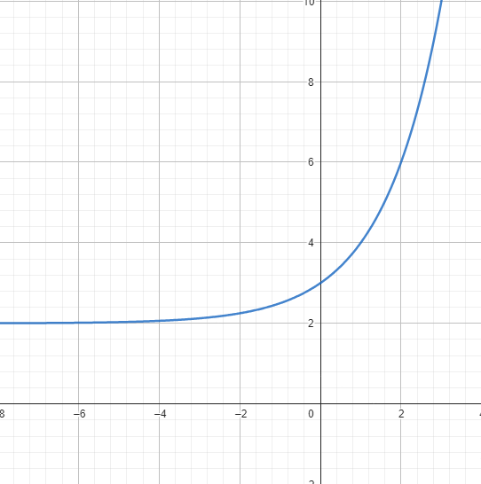
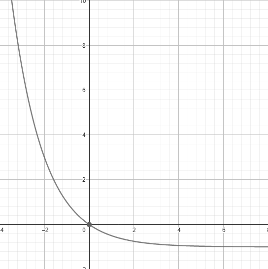
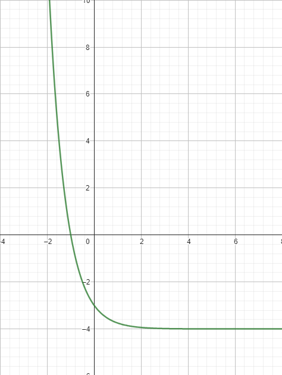

[Wstecz](../matematyka.md)

# Przekształcanie wykresów funkcji wykładniczej

$`f(x)=2^x`$

| x        | -2              | -1              | 0   | 1   | 2   |
| -------- | --------------- | --------------- | --- | --- | --- |
| $`f(x)`$ | $`\frac{1}{4}`$ | $`\frac{1}{2}`$ | 1   | 2   | 4   |

$`g(x)=2^x+2`$

$`2^x\xrightarrow{[0,2]}2^x+2`$

$`h(x)=2^{x+2}`$

$`2^x\xrightarrow{[-2,0]}2^{x+2}`$

$`k(x)=\sqrt2 \cdot 2^x=2^{\frac12} \cdot 2^x=2^{x+\frac12}`$

$`2^x\xrightarrow{[-\frac12,0]}2^{x+\frac12}`$

$`i(x)=\frac{2^{x+3}+4}{4}=\frac{2^{x+3}}{4}+\frac{4}{4} = \frac{2^{x+3}}{2^2}+1=2^{x+3-2}+1=2^{x+1}+1``$

$`2^x\xrightarrow{[-1,1]}2^{x+1}+1`$

$`j(x)=-2^x`$

$`2^x\xrightarrow{Sox}-2^x`$

### Zadanie 1/293

#### a)

$`f(x)=2^x+2`$

| x        | -1               | 0   | 1   | 2   |
| -------- | ---------------- | --- | --- | --- |
| $`f(x)`$ | $`2\frac{1}{2}`$ | 3   | 4   | 6   |

$`Z_w=(2,+\infty)`$

$`y=2`$

#### c)

$`f(x)=(\frac12)^x-1`$

| x        | -2  | -1  | 0   | 1            |
| -------- | --- | --- | --- | ------------ |
| $`f(x)`$ | 3   | 1   | 0   | $`-\frac12`$ |

$`Z_w=(-1,+\infty)`$

$`f(x)=0`$ dla $`x=0`$

$`y=-1`$

#### e)

$`f(x)=4^{-x}-4`$

| x        | -1  | 0   | 1                 | 2                   |
| -------- | --- | --- | ----------------- | ------------------- |
| $`f(x)`$ | 0   | -3  | $`-3\frac{3}{4}`$ | $`-3\frac{15}{16}`$ |

$`Z_w=(-4,+\infty)`$

$`f(x)=0`$ dla $`x=-1`$

$`y=-4`$
