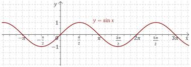
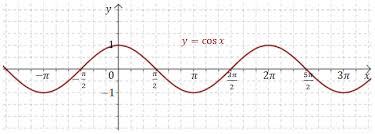
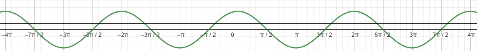

[Wstecz](../matematyka.md)

# Rysowanie funkcji sinus i cosinus

**WŁAŚCIWOŚCI $`f(x)=\sin(x)`$:**

-   $`D=\mathbb{R}`$ (dziedzina: zbiór liczb rzeczywistych)
-   $`Z_w=[-1,1]`$ (zbiór wartości: przedział domknięty od -1 do 1)
-   $`f\uparrow \text{dla} \space x \in (-\frac{\pi}{2}+2k\pi,\frac{\pi}{2}+2k\pi), k \in \mathbb{Z}`$ (funkcja rosnąca w podanych przedziałach)
-   $`f\downarrow \text{dla} \space x \in (\frac{\pi}{2}+2k\pi,\frac{3\pi}{2}+2k\pi), k \in \mathbb{Z}`$ (funkcja malejąca w podanych przedziałach)
-   Miejsca zerowe: $`x_o=k\pi, k \in \mathbb{Z}`$
-   $`f_\text{max}=1 \space \text{dla} \space x=\frac{\pi}{2}+2k\pi, k \in \mathbb{Z}`$ (wartość maksymalna)
-   $`f_\text{min}=-1 \space \text{dla} \space x=\frac{3\pi}{2}+2k\pi, k \in \mathbb{Z}`$ (wartość minimalna)
-   Okresowość: $`T = 2\pi`$

---

**WŁAŚCIWOŚCI $`f(x)=\cos(x)`$:**

-   $`D=\mathbb{R}`$ (dziedzina: zbiór liczb rzeczywistych)
-   $`Z_w=[-1,1]`$ (zbiór wartości: przedział domknięty od -1 do 1)
-   $`f\uparrow \text{dla} \space x \in (\pi+2k\pi,2\pi+2k\pi), k \in \mathbb{Z}`$ (funkcja rosnąca w podanych przedziałach)
-   $`f\downarrow \text{dla} \space x \in (2k\pi,\pi+2k\pi), k \in \mathbb{Z}`$ (funkcja malejąca w podanych przedziałach)
-   Miejsca zerowe: $`x_o=\frac{\pi}{2} + k\pi, k \in \mathbb{Z}`$
-   $`f_\text{max}=1 \space \text{dla} \space x=2k\pi, k \in \mathbb{Z}`$ (wartość maksymalna)
-   $`f_\text{min}=-1 \space \text{dla} \space x=\pi+2k\pi, k \in \mathbb{Z}`$ (wartość minimalna)
-   Okresowość: $`T = 2\pi`$

### Ćwiczenie 4

$`f(x)=\cos(x)`$

**a.** $`cos(x)=1 \text{ dla } x=2k\pi, k\in\mathbb{Z}`$

**b.** $`cos(x)=0 \text{ dla } x=\frac{\pi}{2}+k\pi, k\in\mathbb{Z}`$

**c.** $`cos(x)=-1 \text{ dla } x=-\pi+2k\pi, k\in\mathbb{Z}`$

### Zadanie 1

$`f(x)=\sin(x)`$

**a.** $`\langle 0;2\pi \rangle \rightarrow 3`$

**d.** $`( 0;32 \rangle \rightarrow 10`$

### Zadanie 6/28

$`\langle -4\pi;4\pi \rangle`$

$`\cos(x)=\frac{1}{3}`$

$`x+(-x)+2\pi-x-2\pi+x+2\pi+x-2\pi-x=0`$
