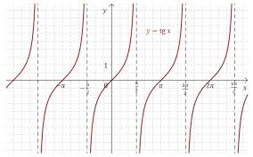
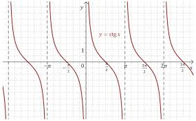

[Wstecz](../matematyka.md)

# Rysowanie funkcji tangens i cotangens

**WŁAŚCIWOŚCI $`f(x)=\mathrm{tg}(x)`$:**

-   $`D = \R \setminus \{\frac{\pi}{2} + k\pi, k \in \Z\}`$ (zbiór liczb rzeczywistych bez punktów, w których cosinus jest równy zero)
-   $`Z_w = \R`$ (zbiór wszystkich liczb rzeczywistych)
-   $`f\uparrow \text{dla} \space x \in (-\frac{\pi}{2} + k\pi, \frac{\pi}{2} + k\pi), k \in \Z`$ (funkcja rosnąca w każdym przedziale określoności)
-   Funkcja nie jest ograniczona ani z góry, ani z dołu, więc nie ma wartości maksymalnych ani minimalnych.
-   Asymptoty pionowe: $`x = \frac{\pi}{2} + k\pi, k \in \Z`$
-   Okresowość: $`T = \pi`$
-   Miejsca zerowe: $`x = k\pi, k \in \Z`$

---

**WŁAŚCIWOŚCI $`f(x)=\mathrm{ctg}(x)`$:**

-   $`D = \R \setminus \{k\pi, k \in \Z\}`$ (zbiór liczb rzeczywistych bez punktów, w których sinus jest równy zero)
-   $`Z_w = \R`$ (zbiór wszystkich liczb rzeczywistych)
-   $`f\downarrow \text{dla} \space x \in (k\pi, \pi + k\pi), k \in \Z`$ (funkcja malejąca w każdym przedziale określoności)
-   Funkcja nie jest ograniczona ani z góry, ani z dołu, więc nie ma wartości maksymalnych ani minimalnych.
-   Asymptoty pionowe: $`x = k\pi, k \in \Z`$
-   Okresowość: $`T = \pi`$
-   Miejsca zerowe: $`x = \frac{\pi}{2} + k\pi, k \in \Z`$

### Zadanie 3/33

$`tg(x)=-\frac{\sqrt{3}}{3} \text{ dla } x=-\frac{\pi}{6}+k\pi`$

$`\frac{5}{6}\pi+1\frac{5}{6}\pi+2\frac{5}{6}\pi+3\frac{5}{6}\pi=9\frac{2}{6}\pi=9\frac{1}{2}\pi`$

### Zadanie 5/33

**a.**

$`\operatorname{tg} x=2-\sqrt{3}`$

$`x=\frac{\pi}{12}+k \pi, \quad k \in \mathbb{Z}`$

$`\langle-\pi ; 2 \pi\rangle`$

$`x \in\left\{-\frac{11 \pi}{12}, \frac{\pi}{12}, \frac{13 \pi}{12}\right\}`$

**b.**

$`\operatorname{tg} x=\sqrt{2}-1`$

$`x=\frac{\pi}{8}+k \pi, \quad k \in \mathbb{Z}`$

$`\langle-\pi ; 2 \pi\rangle`$

$`x \in\left\{-\frac{7 \pi}{8}, \frac{\pi}{8}, \frac{9 \pi}{8}\right\}`$

**c.**

$`\operatorname{ctg} x=2-\sqrt{3}`$

$`x=\frac{5 \pi}{12}+k \pi, \quad k \in \mathbb{Z}`$

$`\langle-\pi ; 2 \pi\rangle`$

$`x \in\left\{-\frac{7 \pi}{12}, \frac{5 \pi}{12}, \frac{17 \pi}{12}\right\}`$

$`\tg\ctg\Z`$