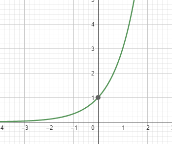
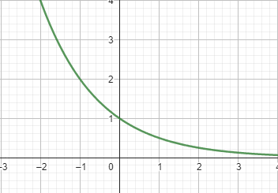

[Wstecz](../matematyka.md)

# Własności funkcji wykładniczej

$`2^{x^2}=16`$

$`x=2 \vee x=-2`$

### Ćwiczenie 1/296

#### e)

$`7^{4x^2+1}=7^2`$

$`4x^2+1=2`$

$`4x^2=1`$

$`x^2=\frac14`$

$`x=\frac12 \vee x=-\frac12`$

#### f)

$`(\frac23)^{2-x^2}=\frac94`$

$`(\frac23)^{2-x^2}=(\frac23)^{-2}`$

$`2-x^2=-2`$

$`-x^2=-4`$

$`x^2=4`$

$`x=2 \vee x=-2`$

#### g)

$`2^{x^3-x}=1`$

$`2^{x^3-x}=2^0`$

$`x^3-x=0`$

$`x=0`$

$`x(x^2-1)=0`$

$`x(x-1)(x+1)=0`$

$`x=1 \vee x=-1 \vee x=0`$

#### h)

$`2^{x^3+x}=4`$

$`2^{x^3+x}=2^2`$

$`x^3+x=2`$

$`x^3+x-2=0`$

$`W(1)=1+1-2=0`$

$`x^3+x-2:x-1=x^2+x+2`$

$`\triangle=1-4 \cdot 1 \cdot 2`$

$`\triangle=-7`$

$`x=1`$

### Zadanie 1/298

#### a)

$`(\frac12)^x=2\sqrt2`$

$`2^{-x}=2^1 \cdot 2^{\frac12}`$

$`2^{-x}=2^{1\frac12}`$

$`-x=1\frac12`$

$`x=-1\frac12`$

#### f)

$`0,4^x=2,5^{x-6}`$

$`(\frac25)^x=(\frac52)^{x-6}`$

$`(\frac52)^{-x}=(\frac52)^{x-6}`$

$`x-6=-x`$

$`2x=6`$

$`x=3`$

### Zadanie 2/298

#### a)

$`2^{|x|}=2^5`$

$`|x|=5`$

$`x=5 \vee x=-5`$

#### e)

$`|2^x-5|=3`$

$`2^x-5=3 \vee 2^x-5=-3`$

$`2^x=8 \vee 2^x=2^1`$

$`2^x=2^3 \vee x=1`$

$`x=3`$

$`x=3 \vee x=1`$

$`3^2<3^5`$

i $`2<5`$

$`(\frac12)^3>(\frac12)^5`$

i $`3<5`$

### Ćwiczenie 3/297

#### a)

$`3^x \leq \frac{1}{243}`$

$`3^x \leq 3^{-5}`$

$`x \leq -5`$

#### f)

$`2^{x^2} \leq 2^4`$

$`x^2 \leq 4`$

$`x^2-4 \leq 0`$

$`(x-2)(x+2) \leq 0`$

$`x \in [-2,2]`$

#### g)

$`3^{x^2+4x}<3^{-3}`$

$`x^2+4x<-3`$

$`x^2+4x+3<0`$

$`\triangle=16-4 \cdot 3=4`$

$`x_1=\frac{-4-2}{2}=-3`$

$`x_2=\frac{-4+2}{2}=-1`$

$`x \in (-3,-1)`$
