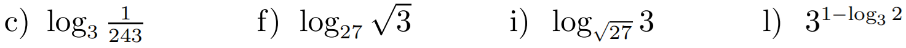
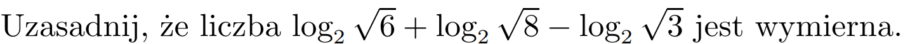
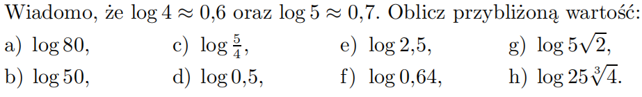

[Wstecz](../matematyka.md)

# Własności logarytmów

$`\log_ax+\log_ay = \log_ax \cdot y`$

$`\log_ax=p \Rightarrow a^p=x`$

$`\log_ay=q \Rightarrow a^q=y`$

$`x \cdot y = a^p \cdot a^q = a^{p+q}`$

$`\log_ax \cdot y = \log_aa^{p+q}`$

$`\log_ax \cdot y = p+q`$

$`\log_ax \cdot y = \log_ax+\log_ay`$

$`\log_ax - \log_ay = \log_a\frac{x}{y}`$

$`\log_ax=p \Rightarrow a^p=x`$

$`\log_ay=q \Rightarrow a^q=y`$

$`\frac{x}{y} = \frac{a^p}{a^q} = a^{p-q}`$

$`\log_a\frac{x}{y} = \log_aa^{p-q}`$

$`\log_a\frac{x}{y} = p-q`$

$`\log_a\frac{x}{y} = \log_ax - \log_ay`$

### Ćw 3/303

**a.** $`\log_64+log_69=\log_64\cdot9=\log_636=2`$

**c.** $`\log_354-\log_32=\log_3\frac{54}{2}=\log_327=3`$

**d.** $`log_515-log_575=\log_5\frac{15}{75}=\log_5\frac{1}{5}=-1`$

**f.** $`\log_{\frac{1}{2}}0,6-\log_{\frac{1}{2}}0,15=\log_{\frac{1}{2}}\frac{0,6}{0,15}=\log_{\frac{1}{2}}4=-2`$

**g.** $`\log_50,04-\log_50,008=\log_5\frac{0,04}{0,008}=\log_55=1`$

### Zad 1/304

**a.** $`\log_{12}2+\log_{12}8+\log_{12}9=\log_{12}2\cdot8\cdot9=\log_{12}144=2`$

**b.** $`\log_3\frac{1}{12}+\log_3\frac{14}{15}+\log_3\frac{10}{21}=\log_3\frac{1}{12}\cdot\frac{14}{15}\cdot\frac{10}{21}=\log_3\frac{1}{27}=-3`$

**c.** $`\log0,12-\log0,3+\log25=\log\frac{0,12}{0,3}\cdot25=\log\frac{3}{0,3}=\log10=1`$

**d.** $`\log_{0,2}0,3-\log_{0,2}0,5-\log_{0,2}15=\log_{0,2}\frac{0,3}{0,5}:15=\log_{0,2}\frac{3}{5}:\frac{15}{1}=\log_{0,2}\frac{3}{5}\cdot\frac{1}{15}=\log_{0,2}\frac{3}{75}=\log_{0,2}\frac{1}{25}=2`$

### Zad 5/304

**$`\log_3x=-\frac{1}{4}`$**

**a.** $`\log_39x^8=\log_39+\log3_x^8=2+8\log_3x=2+8\cdot-\frac{1}{4}=2+(-2)=0`$

**b.** $`\log_3\frac{x^4}{81}=\log_3x^4-\log_381=4\log_3x-4=4\cdot(-\frac{1}{4})-4=-5`$

**c.** $`\log_3\sqrt[4]{3x^6}=\log_33^{\frac{1}{4}}x^{\frac{3}{2}}=\frac{1}{4}\log_33+\frac{3}{2}\log_3x=\frac{1}{4}+\frac{3}{2}\cdot(-\frac{1}{4})=-\frac{1}{8}`$

## PRACA WŁASNA

**c.** $`\log_3\frac{1}{243}=-5`$

**f.** $`\log_{27}\sqrt3=\frac{1}{6}`$

**i.** $`\log_{\sqrt{27}}3=\frac{2}{3}`$

**l.** $`3^{1-\log_32}=3^{1-}=\frac{3}{2}`$

$`\log_2\sqrt6+\log_2\sqrt8-\log_2\sqrt3=\log_2\sqrt{6\cdot8}-\log_2\sqrt3=\log_2\frac{\sqrt{48}}{\sqrt3}=\log_24=2`$

$`2 \in Q`$

**a.** $`\log80=\log4\cdot4\cdot5=\log4+\log4+\log5\approx0,6+0,6+0,7\approx1,9`$

**b.** $`\log50=\log10\cdot5=\log10+\log5\approx1+0,7\approx1,7``$

**g.** $`\log5\sqrt2=\log\sqrt{25\cdot2}=\log\sqrt{50}=\log\sqrt{10\cdot5}=\log\sqrt{10}+\log\sqrt5\approx\frac{1}{2}+0,35=0,85`$

**h.** $`\log25\sqrt[3]4 = \log5^2\cdot4^{\frac{1}{3}}=\log5^2+\log4^{\frac{1}{3}}=2\log5+\frac{1}{3}\log4\approx2\cdot0,7+\frac{1}{3}\cdot0,6=1,4+0,2=1,6`$
