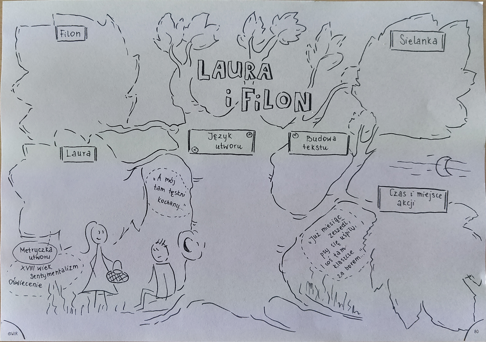

[Wstecz](../polski.md)

# Sentymentalna twórczość Franciszka Karpińskiego

Sentymentalizm był skierowany do mieszczaństwa i drobnej szlachty, nie podważał wartości rozumu, ale upominał się o uczuciach. Bohaterem był zwykły człowiek, postać często z ludu, kochający wrażliwy indywidualista

Kluczowe pojęcia sentymentu:

-   serce
-   uczuciowość
-   czułość
-   natura

Podmiot liryczny to człowiek prosty, ale bardzo czuły, odsłaniający sferę własnych doznań, wrażliwy, a nawet nadwrażliwy - bardzo łatwo się wzrusza.

Gatunki uprawiane w tym nurcie:

-   sielanka
-   pieśń liryczna
-   elegia

**Filon** to młody mężczyzna, zakochany w Laurze. Jest opisany jako przystojny i czarujący. Jest nieśmiały i niepewny swoich uczuć. Często ucieka w marzenia i fantazje.

**Laura** to młoda kobieta, zakochana w Filonie. Jest opisana jako piękna i delikatna. Jest pewna siebie i swoich uczuć. Często jest zazdrosna o Filona.

**Sielanka** to gatunek literacki, którego tematem jest życie na wsi, ukazane w sposób idylliczny i romantyczny. W sielance dominują motywy miłości, szczęścia i harmonii z naturą. **Laura i Filon** to sielanka o miłości dwojga młodych ludzi, którzy spotykają się w idyllicznej scenerii wiejskiej.

**Język utworu** jest prosty i przejrzysty. Wykorzystane są liczne środki stylistyczne, takie jak metafory, porównania i personifikacje. Język utworu służy budowaniu nastroju i atmosfery.

**Budowa tekstu** utworu składa się z czterdziestu dziewięciu czterowersowych strof. Strofy są zbudowane w układzie krzyżowym, z rymami żeńskimi. Utwór ma regularną budowę, co nadaje mu rytm i melodyjność.

**Czas i miejsce akcji** utworu rozgrywa się w letniej nocy, na wsi. Miejscem akcji jest łąka, pod którą rośnie jawor. Atmosfera utworu jest sielankowa i romantyczna.
