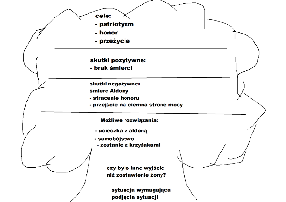

[Wstecz](../polski.md)

# “Szczęścia w domu nie znalazł, bo go nie było w ojczyźnie” - etyczny wymiar czynów Konrada Wallenroda

Jakie decyzje powinien podjąć Konrad mierząc się z:

-   podjęciem nieetycznej walki z wrogiem
-   zaślubin z Aldoną i opuszczeniem ukochanej

**Podjęcie nieetycznej walki z wrogiem:**

**Wariant 1:**

**Wady:**

-   Złamanie moralnych i etycznych zasad.
-   Zagrożenie dla własnej duszy i zbawienia.
-   Ryzyko utraty honoru i szacunku.
-   Możliwość zemsty ze strony wroga.
-   Poczucie winy i wyrzuty sumienia.

**Zalety:**

-   Szybka i prawdopodobnie skuteczna eliminacja wroga.
-   Ocalenie życia i bezpieczeństwa ukochanej osoby.
-   Możliwość zemsty za doznane krzywdy.
-   Satysfakcja z pokonania wroga.

**Wariant 2:**

**Wady:**

-   Dłuższa i bardziej wyczerpująca walka.
-   Ryzyko niepowodzenia i śmierci.
-   Możliwość dalszych cierpień ukochanej osoby.
-   Poczucie bezsilności i frustracji.

**Zalety:**

-   Zachowanie moralnej czystości i spokoju sumienia.
-   Utrzymanie honoru i szacunku.
-   Możliwość zbudowania silniejszego i bardziej szlachetnego charakteru.
-   Nadzieja na ostateczne zwycięstwo dobra nad złem.

**Zaślubiny z Aldoną i opuszczenie ukochanej:**

**Wariant 1:**

**Wady:**

-   Zdrada ukochanej i złamanie danego jej słowa.
-   Nieszczęśliwe małżeństwo bez miłości.
-   Poczucie winy i wyrzuty sumienia.
-   Możliwość konfliktu z Aldoną i jej rodziną.

**Zalety:**

-   Spełnienie obowiązku i honoru wobec rodziny i ojczyzny.
-   Zapewnienie bezpieczeństwa i stabilizacji Aldonie.
-   Możliwość zbudowania nowego życia i założenia rodziny.
-   Uwolnienie ukochanej od cierpienia i niepewności.

**Wariant 2:**

**Wady:**

-   Narażenie ukochanej na dalsze cierpienie i niebezpieczeństwo.
-   Pogłębienie konfliktu z wrogiem.
-   Poczucie winy i niespełnienia.
-   Możliwość utraty ukochanej na zawsze.

**Zalety:**

-   Zachowanie wierności i miłości do ukochanej.
-   Możliwość walki o wspólną przyszłość.
-   Poczucie czystości i prawdomówności.
-   Nadzieja na szczęśliwe życie z ukochaną.
