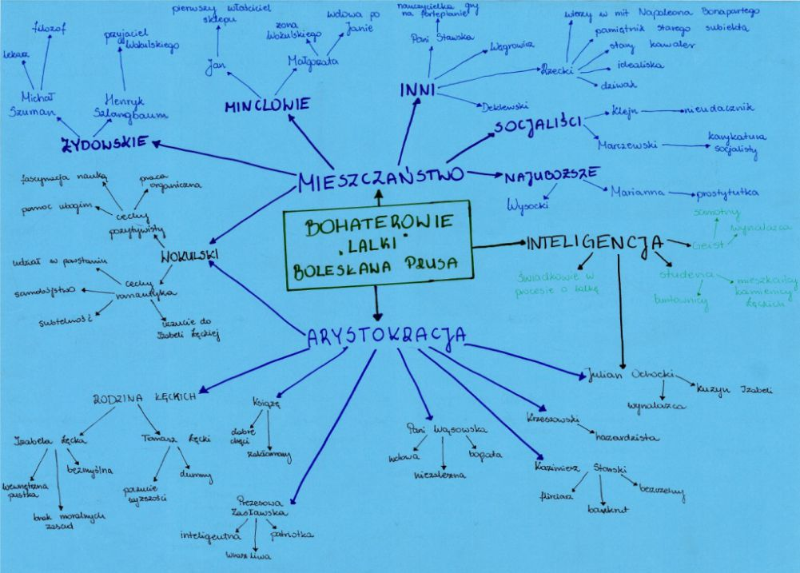

[Wstecz](../polski.md)

# Wokół "Lalki" Bolesława Prusa - informacje wstępne o lekturze

### Bolesław Prus

-   prawdziwe imię i nazwisko: Aleksander Głowacki

-   urodzony: 20 sierpnia 1847

-   zmarł: 19 maja 1912

-   zajęcia:

    -   Dziennikarstwo
    -   Pisarz
    -   Publicysta
    -   Propagator turystyki pieszej i rowerowej

-   najważniejsze dzieła:

    -   Lalka
    -   Faraon
    -   Placówka
    -   Kamizelka
    -   Emancypantki
    -   Katarynka
    -   Kroniki tygodniowe

### Pojęcia i informacje

**Realizm** – Kierunek literacki i artystyczny dominujący w XIX wieku, charakteryzujący się dążeniem do wiernego przedstawiania rzeczywistości. Realizm skupia się na problemach codziennego życia, zwykłych ludziach i dokładnym opisie świata materialnego oraz relacji społecznych.

**Praca organiczna** – Idea rozwijana w Polsce pod zaborami, głównie w XIX wieku. Polegała na promowaniu oddolnej pracy społecznej i ekonomicznej, dążącej do rozwoju gospodarczego i kulturowego kraju jako formy walki o niepodległość. Zwolennicy pracy organicznej zakładali, że silne, wykształcone społeczeństwo lepiej poradzi sobie w warunkach zaborów i przyczyni się do odbudowy niepodległości.

**Utylitaryzm** – Nurt filozoficzny i etyczny, którego głównym założeniem jest osiąganie jak największego dobra dla jak największej liczby ludzi. Działania są oceniane pod kątem ich użyteczności, czyli tego, jak bardzo przyczyniają się do szczęścia i dobrobytu społecznego. W literaturze pozytywistycznej często promowano użyteczność pracy dla społeczeństwa.

**W jakim czasopiśmie i kiedy ukazywała się "Lalka"?**

"Lalka" Bolesława Prusa była początkowo publikowana w odcinkach na łamach czasopisma "Kurier Codzienny" od 29 września 1887 do 24 maja 1889 roku.

**W jakim wydawnictwie i kiedy została wydana "Lalka"?**

Pełne wydanie "Lalki" jako powieści ukazało się w 1890 roku nakładem wydawnictwa Gebethner i Wolff w Warszawie.

### Wynotuj

**czas akcji** - około lat 1878–1879

**miejsca akcji:**

-   Warszawa:\*\*

    -   Krakowskie Przedmieście – główna ulica Warszawy, symbol bogactwa i miejskiego życia.
    -   Powiśle – biedna dzielnica zamieszkana przez najuboższych.
    -   Plac Bankowy – miejsce o dużym znaczeniu dla życia społecznego i handlowego.
    -   Kamienica Łęckich – miejsce zamieszkania Izabeli Łęckiej.
    -   Sklep Wokulskiego – centrum działalności handlowej głównego bohatera.
    -   Teatr – ważne miejsce spotkań towarzyskich i kulturalnych warszawskiej elity.
    -   Hotel Europejski – miejsce spotkań elity, w którym przebywa Wokulski.

-   **Zasławek** – fikcyjne miasteczko na prowincji, związane z ziemiańskimi tradycjami i - idealizowaną polskością.

-   **Paryż** – symbol nowoczesności, do którego udaje się Wokulski, by rozwijać swoją wiedzę i interesy.

### Geneza

-   **Obserwacja polskiego społeczeństwa** – Prus, jako pisarz i felietonista, był zaangażowany w życie Warszawy końca XIX wieku. Obserwował trudną sytuację społeczną Polaków pod zaborami, zróżnicowane podejście do patriotyzmu, a także problemy z rozwojem gospodarczym. Jego chęć przedstawienia realistycznego obrazu społeczeństwa miejskiego i konfliktów klasowych w literaturze była główną inspiracją dla stworzenia tego dzieła.

-   **Idea pozytywizmu** – W okresie powstania Lalki dominowała ideologia pozytywistyczna, promująca pracę organiczną i utylitarne podejście do życia. Prus chciał pokazać rozbieżność między ideałami pozytywistycznymi a rzeczywistością społeczną, w której ideały te często były ignorowane. Konflikt wartości oraz podejście bohaterów, takich jak Stanisław Wokulski, do pracy i patriotyzmu miały podkreślić trudności w realizacji pozytywistycznych postulatów w realiach zaborów.

