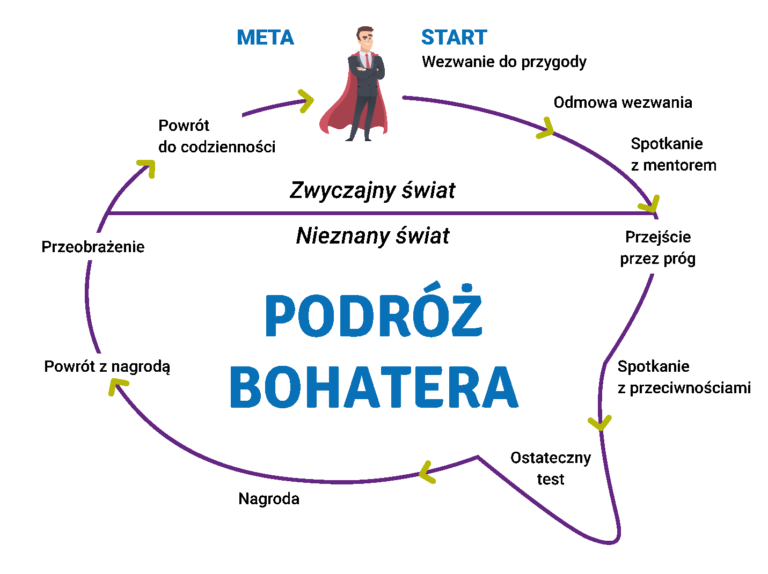

[Wstecz](../skai.md)

# Monomit

### Wersja 4:

**Temat:** Stwórz wizualizację monomitu

**Opis zadania:** Użyj narzędzia **DALL-E** lub **MidJourney**, aby stworzyć serię obrazów, które ilustrują etapy monomitu w wybranej historii (książce, filmie lub grze).

**Narzędzia Al:** DALL-E, MidJourney

**Wezwanie do przygody**

Wizualizacja: Młody chłopiec w zwykłym świecie otrzymuje tajemniczy list, otwierający przed nim drzwi do magicznego świata. Obraz przedstawia go na tle zwykłego domu, z tajemniczym listem w ręku, a w oddali widnieje zamek w świecie magii.

**Odmowa wezwania**

Wizualizacja: Chłopiec początkowo jest niepewny swojej nowej roli i wątpi w swoje miejsce w świecie magii. Można to pokazać poprzez scenę, gdzie waha się, patrząc na magiczny bilet lub drogę do tajemniczego zamku.

**Spotkanie z mentorem**

Wizualizacja: Doświadczony czarodziej lub mentorka wprowadza chłopca w tajniki magii, oferując mu pomoc. Obraz może przedstawiać starszą postać w szacie, pokazującą chłopcu księgi lub magiczne przedmioty, z symboliką mądrości i ochrony.

**Przejście przez próg**

Wizualizacja: Bohater przekracza granicę między światem zwykłym a magicznym, np. wkraczając do ukrytej magicznej szkoły. Obraz może przedstawiać bramę lub portal, przez który przechodzi chłopiec, wchodząc do świata pełnego niesamowitych stworzeń.

**Spotkanie z przeciwnościami**

Wizualizacja: Bohater zaczyna zdobywać sojuszników i stawia czoła wrogom. Scena może ukazać grupę przyjaciół z różdżkami lub magicznymi przedmiotami, stojących naprzeciw ciemnym, złowrogim postaciom w cieniu.

**Ostateczny test**

Wizualizacja: Bohater walczy z najpotężniejszym przeciwnikiem. Obraz przedstawia decydującą walkę, w której widać potężną moc magiczną – starcie dwóch postaci, pełne światła i mroku.

**Nagroda**

Wizualizacja: Bohater otrzymuje nagrodę, np. zdobywa magiczny artefakt lub symbol zwycięstwa, który chroni jego świat. Może to być jasny, promieniujący przedmiot, trzymany przez bohatera.

**Powrót z nagrodą**

Wizualizacja: Bohater wraca do swojego świata, już jako dojrzała, mądra postać. Można przedstawić, jak wraca do domu, jednak teraz wszystko wygląda inaczej, bo sam bohater jest odmieniony przez swoje doświadczenia.

**Przeobrażenie**

Wizualizacja: Bohater, po wszystkich swoich doświadczeniach, ulega wewnętrznej przemianie. Już nie jest tym samym młodym, niepewnym chłopcem, lecz kimś, kto zdobył wiedzę, siłę i odpowiedzialność. Obraz może ukazywać bohatera w medytacyjnej pozie, otoczonego subtelnym blaskiem, symbolizującym jego rozwój duchowy i mądrość, którą zdobył.

**Powrót do codzienności**

Wizualizacja: Bohater powraca do swojego zwykłego życia, ale teraz postrzega świat inaczej. Może to być scena w tym samym miejscu, w którym zaczęła się jego podróż, np. przed jego domem, ale teraz świat wydaje się jaśniejszy, bardziej harmonijny. Bohater, choć wraca do codzienności, jest już dojrzałą, pełną doświadczeń osobą, gotową do dalszych wyzwań
